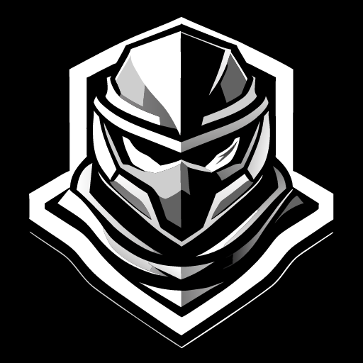

# Quantum Catastrophe

## Oyun Hakkında

Quantum Catastrophe, Doom ve Quake gibi klasik FPS oyunlarından ilham alan bir aksiyon oyunudur. Oyuncular, özel bir operasyon timine katılan Ray adlı bir asker olarak görev alacaklar. Kaskının içindeki yapay zeka, Freya, oyunculara yardımcı olacak ve farklı ortamlarda çeşitli düşmanları temizlemek için operasyon timine liderlik edecektir.

## Oyun Özellikleri

- Farklı oyun ortamları: Oyuncular, yeraltı tünellerinden uzay istasyonlarına kadar farklı ve çarpıcı ortamlarda görevler üstlenecekler.
- Geniş silah yelpazesi: Oyunda birçok çeşit silah bulunacak ve oyuncular istedikleri silahı seçebilecekler.
- Güçlendirmeler: Karakterinizin yeteneklerini artırmak için çeşitli güçlendirmeleri toplayabileceksiniz.

## Nasıl Oynanır

1. [ITCH.IO Linki]("https://github.com/Nekx86/Project-Quantum-Catastrophe/edit/main/README.md") bağlantısı.
2. Oyunu başlatın ve ana menüden "Yeni Oyun" seçeneğini seçin.
3. Görevler arasında seyahat edin, düşmanları temizleyin ve güçlendirmeleri toplayın.
4. Ray ve Freya'nın hikayesi boyunca ilerleyin ve sırları açığa çıkarın.

## Geliştirme

Bu oyun, **NDX64 Entertainment** tarafından geliştirilmektedir. Oyunun açık kaynak kodları Github üzerinde bulunabilir.

## Destek ve İletişim

- Oyunla ilgili sorularınız veya geri bildirimleriniz için Discord adresinden bizimle iletişime geçebilirsiniz.

## Lisans

Bu oyun **CC BY-NC 4.0** altında lisanslanmıştır.

## Kullanılan Assetler & Diğer Öğeler
**Asset Paket Listesi**

**Müzikler**
Nitro Fun - New Game [Monstercat Release] 
Tokyo Machine - Turbo [Monstercat Release] 

**Support on Nitro Fun**
▼ Follow Nitro Fun:
Facebook: http://www.facebook.com/NitroFunOfficial
Soundcloud: http://soundcloud.com/nitrofun
YouTube: https://www.youtube.com/nitrofunofficial

**Support on Tokyo Machine**
▼ Follow Tokyo Machine
Facebook: https://facebook.com/tokyomachine
Twitter: https://twitter.com/tokyomachine
Instagram: https://instagram.com/tokyomachine
SoundCloud: https://soundcloud.com/tokyomachine
YouTube: https://www.youtube.com/tokyomachine

**Support on Monstercat**
▼ Follow Monstercat
Spotify: https://monster.cat/2biZbkd
Apple: https://apple.co/2xiKWTO
Facebook: https://facebook.com/monstercat
Twitter: https://twitter.com/monstercat
Instagram: https://instagram.com/monstercat
 
---
© **NDX64 Entertainment**
